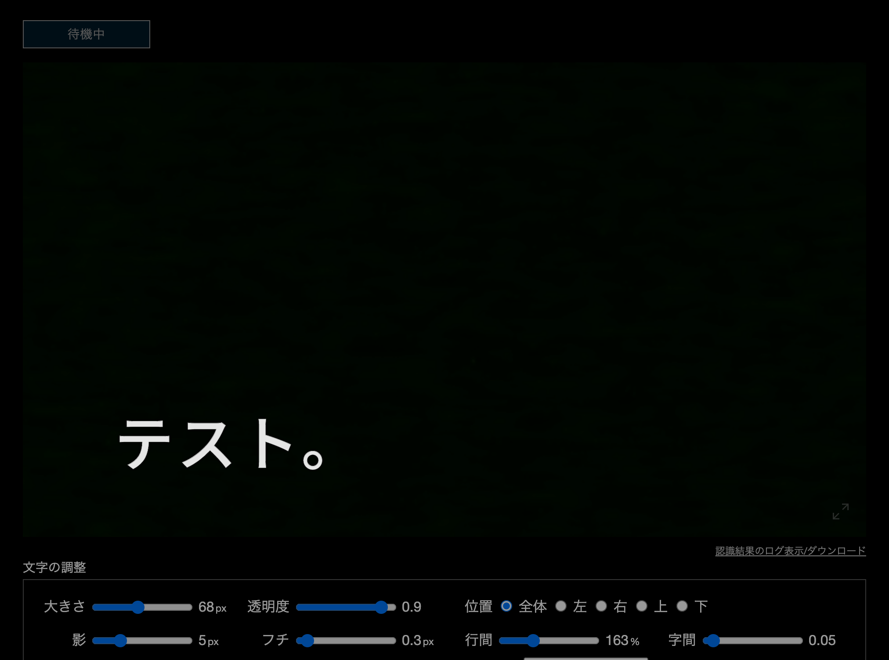

# はじめに

耳が聞こえづらい人を交えた、不特定多数が参加するZoomミーティングにて、自動音声字幕を点字リーダーでも読み出せる形で表示すべく用意したもの

# 構成

- Zoom音声 -> Web Speech APIによる音声認識 -> Flaskローカルサーバ -> Zoom字幕API -> 字幕表示
- [Webカメラの映像に自動字幕を重ねるWebページ](https://github.com/1heisuzuki/speech-to-text-webcam-overlay)を少し変更して、Zoom APIに字幕情報を投げようと思ったが、クロスドメイン制約があるので、Flaskによるローカルサーバを介して、Zoomにアクセスするように少し工夫しただけ




# 準備

### Zoom参加者全員の音声を取り込むために、仮想オーディオデバイスを用意

- blackholeのインストール(mac)
```
$ brew cask install blackhole
```
- システムの音声出入力設定にてblackholeを指定


### flaskのインストール

```
$ pip install -r requirements.txt
```

### Zoomのミーティングを開始し、字幕用のトークンURLを取得


# 実行方法

```
$ ZOOM_TOKEN_URL='https://wmcc.zoom.us/closedcaption?id=... python app.py
```

http://127.0.0.1:5000/ にアクセスし、マイクへのアクセスを許可

# ベースとなった実装

- https://github.com/1heisuzuki/speech-to-text-webcam-overlay
  - commit: 8448f54 (Fri Jun 5 17:27:40 2020 +0900)
- https://github.com/atilika/kuromoji
  - 形態素解析などに使われている

# さいごに

- 不特定多数の人が色々喋った場合、音声認識の結果が微妙な感じになる。
- よって、きれいな音声環境かつ発表形式のときくらいしか活用出来ないかも。
- 雑談系のときは、各自が音声認識->字幕の手段を個別に用意したほうが無難（調べればいくつか手段ある）

